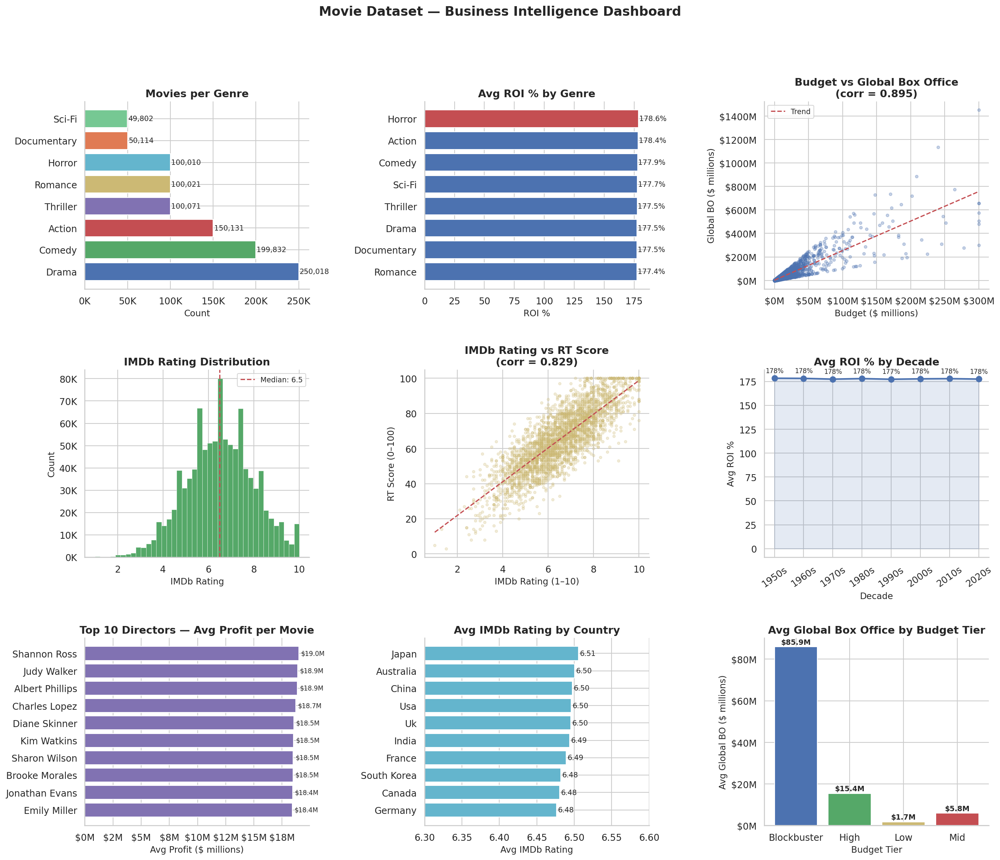
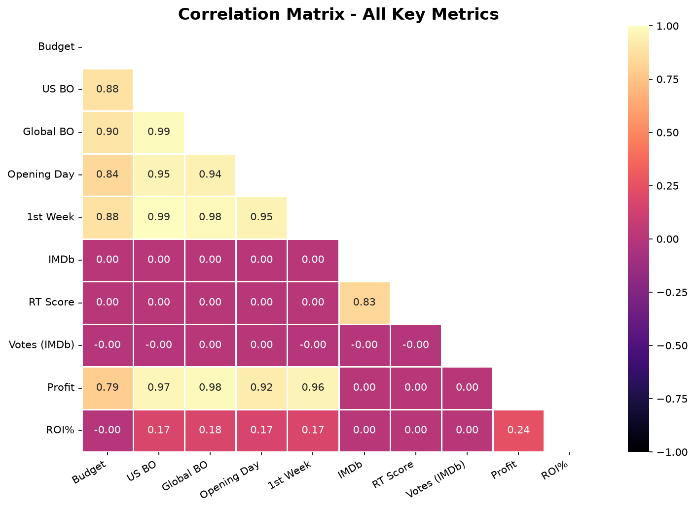

# 🎬 Movie Industry — End-to-End Data Analysis Project


> **End-to-end data analysis of 999,999 movies spanning 1950–2025 across 10 countries and 8 genres.
> Built to answer real business questions about what drives box office success, profitability, and audience quality perception.**

---

## 📌 Table of Contents

- [Project Overview](#project-overview)
- [Dataset](#dataset)
- [Tools & Technologies](#tools--technologies)
- [Project Structure](#project-structure)
- [Phase 1 — Data Cleaning](#phase-1--data-cleaning)
- [Phase 2 — Exploratory Data Analysis](#phase-2--exploratory-data-analysis)
- [Phase 3 — Power BI Dashboard](#phase-3--power-bi-dashboard)
- [Key Business Insights](#key-business-insights)
- [Visualizations](#visualizations)
- [How to Run](#how-to-run)
- [Author](#author)

---

## 📖 Project Overview

The movie industry is one of the most data-rich and commercially competitive industries in the world. Studios invest hundreds of millions of dollars per film with no guarantee of return — making data-driven decision making critically important.

This project follows a **5-phase analytical workflow:**

```
Raw Data → Data Cleaning → EDA → Python Visualizations → Power BI Dashboard → Business Insights
```

**Business questions answered:**
- What is the strongest predictor of a movie's total box office earnings?
- Does a higher budget guarantee better audience ratings?
- Which genre delivers the highest return on investment?
- How consistent are IMDb and Rotten Tomatoes in measuring quality?
- Which decade produced the most profitable films?
- Does opening day performance predict lifetime revenue?

---

## 📊 Dataset

| Property | Detail |
|---|---|
| **File** | `movies_dataset` (compressed as `Raw_dataset.zip`) |
| **Total records** | 999,999 movies |
| **Time period** | 1950 – 2020 |
| **Original columns** | 17 |
| **Final columns after cleaning** | 27 |
| **Genres** | Action, Comedy, Documentary, Drama, Horror, Romance, Sci-Fi, Thriller |
| **Countries** | USA, UK, India, China, Canada, Australia, France, Germany, Japan, South Korea |

**Original columns:**
`MovieID`, `Title`, `Genre`, `ReleaseYear`, `ReleaseDate`, `Country`, `BudgetUSD`, `US_BoxOfficeUSD`, `Global_BoxOfficeUSD`, `Opening_Day_SalesUSD`, `One_Week_SalesUSD`, `IMDbRating`, `RottenTomatoesScore`, `NumVotesIMDb`, `NumVotesRT`, `Director`, `LeadActor`

**Derived columns engineered:**
| Column | Formula | Purpose |
|---|---|---|
| `ProfitUSD` | Global BO − Budget | Actual earnings after cost |
| `ROI_pct` | (Profit / Budget) × 100 | Normalized profitability |
| `OpeningWeekRatio` | Week1 Sales / Global BO | Word-of-mouth indicator |
| `Decade` | ReleaseYear // 10 | Era-based trend analysis |
| `AvgScore` | (IMDb×10 + RT) / 2 | Unified critic score |
| `BudgetTier` | Quartile bins | 4-level budget grouping |
| `IsBlockbuster` | Budget > 95th percentile | Top 5% budget flag |

---

## 🛠 Tools & Technologies

| Tool | 
|---|
| Python | 
| Pandas | 
| NumPy |
| Matplotlib | 
| Seaborn | 
| Power BI Desktop | 
| GitHub |

---

## 📁 Project Structure

```
movie-analysis-da-project/
│
├── data/
│   └── movies_data.zip          ← compressed raw + clean dataset
│
├── notebooks/
│   ├── Loading_And_Cleaning.ipynb    ← data cleaning 
|   ├── EDA.ipynb                     ← EDA script 
│   └── Data_Visualization.ipynb      ← all visualization code
│
├── dashboard/
│   └── movie_dashboard.pbix     ← Power BI dashboard file
│
├── charts/
│   ├── movies_dashboard.png     ← 9-panel overview chart
│   ├── movies_correlation.png   ← correlation heatmap
│   └── movies_profit_genre.png  ← profit distribution by genre
│
└── README.md
```

---

## Phase 1 — Data Cleaning

**Script:** `notebooks/Loading_And_Cleaning.ipynb`

**Audit findings on raw data:**
- ✅ Zero missing values across all 17 columns
- ✅ Zero duplicate rows or duplicate MovieIDs
- ✅ Zero out-of-range rating values
- ⚠️ `ReleaseDate` stored as string (`DD-MM-YY`) — converted to datetime
- ⚠️ Text columns had inconsistent casing — standardized with `.strip().title()`
- ⚠️ ~11% outliers in money columns — flagged, not removed

**Actions taken:**
- Converted `ReleaseDate` to proper datetime format
- Extracted `ReleaseMonth` and `ReleaseDayName` for time analysis
- Converted `Genre` and `Country` to `category` dtype (memory optimization on 1M rows)
- Flagged top 5% budget films as `IsBlockbuster`
- Engineered 7 new derived columns (see table above)

**Output:** `movies_clean.csv` — 999,999 rows × 27 columns | 0 nulls | 0 duplicates

---

## Phase 2 — Exploratory Data Analysis

**Script:** `notebooks/EDA.ipynb`

8 business questions answered using GroupBy, correlation analysis and pivot tables:

| # | Question | Method | Key Finding |
|---|---|---|---|
| Q1 | Which genre is most profitable? | groupby + mean ROI | Horror leads at 178.6% ROI |
| Q2 | Does budget guarantee box office? | corr() | r = 0.895 — very strong |
| Q3 | Does budget guarantee quality? | corr() | r = 0.001 — no relationship |
| Q4 | Best decade for ROI? | groupby + mean | All decades ~177–178% — flat |
| Q5 | Does opening day predict total BO? | corr() | r = 0.941 — strongest signal |
| Q6 | Which country rates highest? | groupby + filter | Japan leads at 6.51 avg IMDb |
| Q7 | Top directors by avg profit? | groupby + Top N | Shannon Ross — $19.0M avg |
| Q8 | Do IMDb and RT agree? | corr() | r = 0.829 — strong agreement |

---

## Phase 3 — Power BI Dashboard

**File:** `dashboard/movie_dashboard.pbix`

3-page interactive dashboard with Genre, Country and Decade slicers on every page:

**Page 1 — Overview**
- KPI Cards: Total Movies, Avg IMDb Rating, Avg ROI%, Total Profit
- Movies Released per Decade (line chart)
- Movies by Genre (bar chart)
- Avg IMDb Rating by Genre (column chart)
- Profit by Genre (bar chart)
- Movie by Country (donut chart)

**Page 2 — Financial Analysis**
- KPI Cards: Avg Budget, Avg Global Box Office, Avg Profit, Avg Opening Day Sales
- Budget vs Global Box Office (scatter plot — corr 0.895)
- Avg Box Office by Budget Tier (bar chart)
- Avg ROI% by Genre (column chart)
- Top 7 Directors by Avg Profit (treemap)
- Avg Profit by Decade (line chart)

**Page 3 — Rating Analysis**
- KPI Cards: Avg IMDb, Avg RT Score, Avg Combined Score, IMDb vs RT Correlation
- IMDb vs RT Score (scatter plot — corr 0.829)
- Top 10 Actors by Avg IMDb (bar chart)
- IMDb Rating Distribution (histogram)
- Avg IMDb by Genre (bar chart)
- Avg IMDb by Decade (line chart)

---

## 💡 Key Business Insights

### 1. Opening Day Predicts Everything (r = 0.941)
Opening Day Sales correlate with Total Global Box Office at **r = 0.941** — the strongest relationship in the dataset. A movie's commercial fate is effectively decided on Day 1.

### 2. Budget Buys Revenue, Not Quality
- Budget → Global Box Office: **r = 0.895** (very strong)
- Budget → IMDb Rating: **r = 0.001** (no relationship)

Money guarantees reach. It cannot buy quality or audience appreciation.

### 3. Horror Has the Best ROI
Horror leads all genres at **178.6% avg ROI** — low production costs with consistently strong audience demand make it the most capital-efficient genre.

### 4. Blockbuster Tier Dominates Box Office
| Budget Tier | Avg Global Box Office |
|---|---|
| Blockbuster (top 5%) | $85.92M |
| High | $15.42M |
| Mid | $5.82M |
| Low | $1.66M |

### 5. Critics Agree Across Platforms (r = 0.829)
IMDb (public votes) and Rotten Tomatoes (critic reviews) agree at **r = 0.829** despite completely different methodologies. Quality is universally recognized.

### 6. Movie Quality Has Been Flat for 70 Years
Average IMDb ratings range from **6.49 to 6.50** across all decades from the 1950s to 2020s — a difference of just 0.01 points. Audience quality perception is self-calibrating across eras.

### 7. USA Dominates Global Production
USA produces **71.5%** of all movies — more than all other countries combined. Despite volume dominance, country of origin has minimal impact on average rating.

### 8. Production Has Grown 6x in 70 Years
Movies per decade grew from **36,800 in the 1950s** to **209,700 in the 2010s** — nearly 6x growth driven by falling production costs and streaming demand.

---

## 📈 Visualizations

### 9-Panel Business Intelligence Dashboard


### Correlation Heatmap — All Key Metrics


### Profit Distribution by Genre


---

## ▶️ How to Run

**1. Clone the repository**
```bash
git clone https://github.com/YOUR_USERNAME/movie-analysis-da-project.git
cd movie-analysis-da-project
```

**2. Install dependencies**
```bash
pip install pandas numpy matplotlib seaborn
```

**3. Extract the dataset**
```bash
# Extract movies_data into the data/ folder
```

**4. Run data cleaning**
```bash
python notebooks/Loading_And_Cleaning.ipynb
```

**5. Run EDA**
```bash
python notebooks/EDA.ipynb
```

**6. Generate charts**
```bash
python notebooks/Data_Visualization.ipynb
```

**7. Open Power BI dashboard**
```
Open dashboard/movie_dashboard.pbix in Power BI Desktop
Connect to data/movies_clean.csv when prompted
```

---

## 👤 Author

**Tanishq**
B.E. Computer Science Engineering

[](https://github.com/Tanishq1222)

---

*This project was built as part of a Data Analytics portfolio targeting DA roles in industry.*
